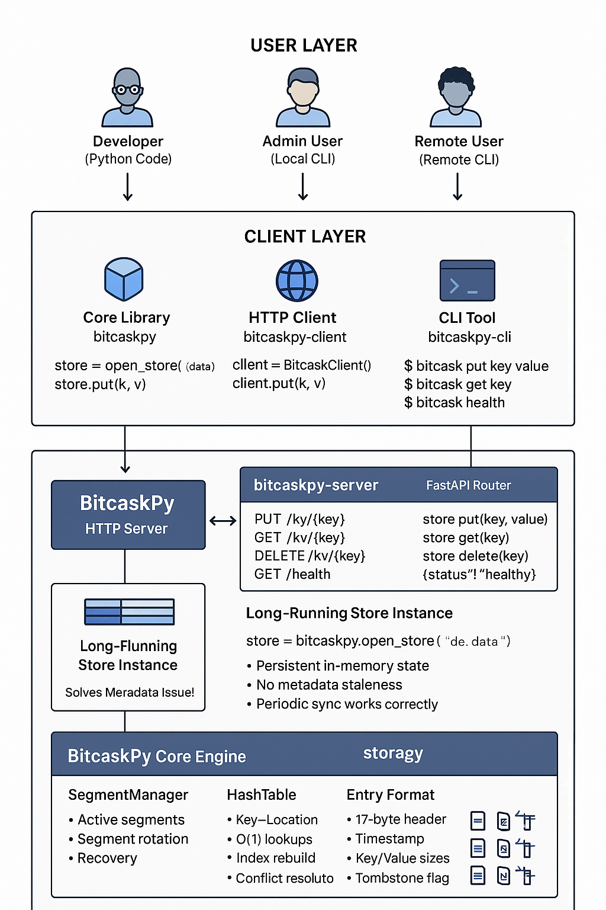

## Project Architecture till now

The project is organized into four main modules:

```
/workspace/projects/bitcaskpy/app/
├── core/           # Core module
└── cli/            # CLI module (separate)
├── server/         # Server module (separate)
└── client/         # Client module (separate)
```

## Architecture Overview



## Data flow diagram

```
CLI Command: `bitcask put foo bar`
│
├─► 1. CLI creates HTTP client
├─► 2. HTTP PUT /kv/foo {"value": "bar"}
├─► 3. Server receives request
├─► 4. FastAPI routes to put_key()
├─► 5. store.put("foo", "bar")                    ┌─────────────────┐
├─► 6. SegmentManager.append()                    │                 │
├─► 7. Create Entry(timestamp, key, value)        │   Long-Running  │
├─► 8. Write to segment_N.log at correct offset   │   Server keeps  │
├─► 9. Update HashTable["foo"] = location         │   state in      │
├─► 10. Log to segment_N.log.index                │   memory!       │
├─► 11. Return HTTP 200 {"status": "success"}     │                 │
└─► 12. CLI displays "Inserted foo -> bar"        └─────────────────┘

CLI Command: `bitcask get foo`
│
├─► 1. CLI creates HTTP client
├─► 2. HTTP GET /kv/foo
├─► 3. Server uses SAME store instance (in memory!)
├─► 4. HashTable lookup: "foo" → segment_id, offset
├─► 5. Read from segment_N.log at offset
├─► 6. Return HTTP 200 {"key": "foo", "value": "bar", "found": true}
└─► 7. CLI displays "bar"
```

## Key Architecture Benefits

### Scalability

```
┌─────────────┐     ┌─────────────┐     ┌─────────────┐
│   CLI #1    │────▶│             │◀────│   CLI #2    │
│ (laptop)    │     │             │     │ (server)    │
└─────────────┘     │             │     └─────────────┘
                    │  BitcaskPy  │
┌─────────────┐     │   Server    │     ┌─────────────┐
│ Python App  │────▶│             │◀────│ Custom Tool │
│ (web server)│     │             │     │ (monitoring)│
└─────────────┘     └─────────────┘     └─────────────┘
```

### Clean Separation of Concerns

- **Core**: Pure Python module for Bitcask storage engine
- **Server**: HTTP API server managing a long-running store instance
- **Client**: HTTP client library for easy integration
- **CLI**: Command-line tool for local and remote administration

---